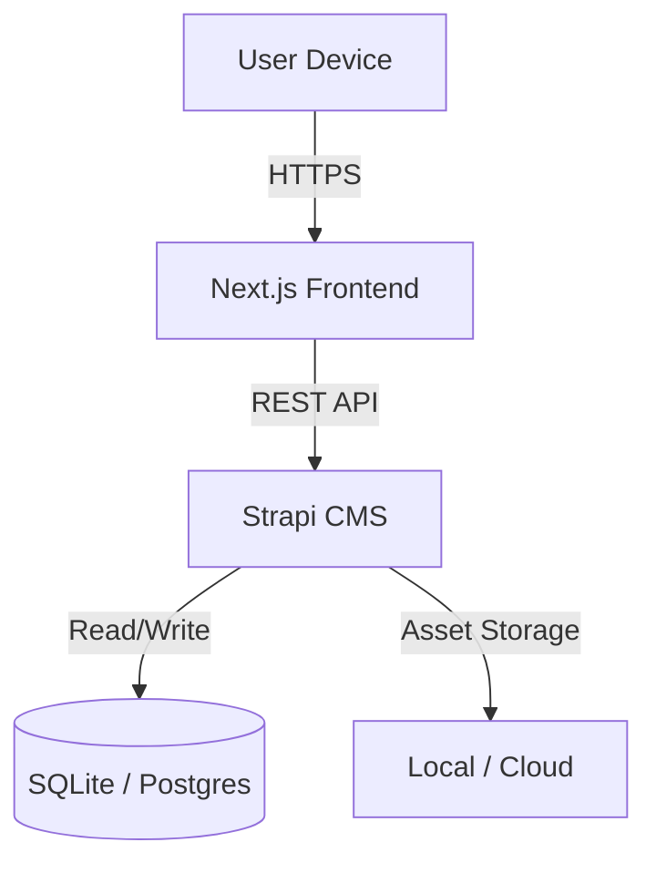

# 🌱 Eco-Habit


**Eco-Habit** is a sustainable lifestyle platform designed to encourage users to adopt eco-friendly habits through daily challenges. Built with a modern tech stack, it features a dynamic content management system and a premium, responsive frontend.

---

## 🚀 Features

*   **Daily Challenges**: Curated eco-friendly tasks to reduce your carbon footprint.
*   **Dynamic Categories**: Organize challenges by themes (e.g., Energy, Waste, Transportation).
*   **Modern Aesthetics**: A nature-inspired, glassmorphic UI integrated with dark mode support.
*   **CMS Powered**: All content is managed via Strapi, allowing for real-time updates without code changes.
*   **Responsive Design**: Fully optimized for desktop, tablet, and mobile devices.

---

## 🛠️ Architecture

Eco-Habit follows a headless architecture, separating the content management (Backend) from the user interface (Frontend).



### Technology Stack

*   **Frontend**: [Next.js 14](https://nextjs.org/) (App Router), [Tailwind CSS](https://tailwindcss.com/) (v4), [Lucide React](https://lucide.dev/), Framer Motion.
*   **Backend**: [Strapi v5](https://strapi.io/), SQLite (Local Dev), TypeScript.
*   **Language**: TypeScript implies type safety across the stack.

---

## 🏁 Getting Started

Follow these instructions to set up the project locally on your machine.

### Prerequisites

*   [Node.js](https://nodejs.org/) (v18 or higher)
*   [npm](https://www.npmjs.com/) (v10 or higher)

### 1. Backend Setup (Strapi)

The backend must be running for the frontend to work.

1.  Navigate to the backend directory:
    ```bash
    cd backend
    ```

2.  Install dependencies:
    ```bash
    npm install
    ```

3.  Start the development server:
    ```bash
    npm run develop
    ```
    *   The server will start at `http://localhost:1337`.
    *   **First Run**: A script in `src/index.ts` will automatically seed the database with sample data (Categories & Challenges) if it's empty.

4.  Access the Admin Panel:
    *   Open `http://localhost:1337/admin`.
    *   Create your admin account if prompted.

### 2. Frontend Setup (Next.js)

1.  Open a new terminal and navigate to the frontend directory:
    ```bash
    cd frontend
    ```

2.  Install dependencies:
    ```bash
    npm install
    ```

3.  Configure Environment Variables (Optional for local):
    *   Create a `.env.local` file if you want to override defaults.
    *   Default Strapi URL is `http://localhost:1337`.

4.  Start the application:
    ```bash
    npm run dev
    ```

5.  Visit `http://localhost:3000` to see the application.

---

## 📦 Deployment

### Frontend (Vercel)

The frontend is optimized for deployment on [Vercel](https://vercel.com/).

1.  Push this repository to GitHub.
2.  Import the project in Vercel.
3.  Set the **Root Directory** to `frontend`.
4.  Add Environment Variables:
    *   `NEXT_PUBLIC_STRAPI_URL`: Your deployed Strapi URL (e.g., `https://my-strapi-app.railway.app`).
5.  Deploy.

### Backend (Strapi)

Since Strapi requires a persistent database and file storage, it cannot be hosted on serverless platforms like Vercel.

**Recommended Options:**
1.  **Strapi Cloud**: The official hosting platform. Easiest setup.
2.  **Railway / Render**: Good for small projects.
    *   **Important**: You must switch from SQLite to PostgreSQL for production.
    *   Update `config/database.ts` to use `postgres` client.

---

## 📂 Project Structure

```
Eco-Habit/
├── backend/                # Strapi CMS
│   ├── src/
│   │   ├── api/            # Content Type definitions (Category, Challenge)
│   │   └── index.ts        # Bootstrap & Seeding logic
│   └── ...
├── frontend/               # Next.js Application
│   ├── src/
│   │   ├── app/            # App Router pages (Home, Category)
│   │   ├── components/     # Reusable UI components
│   │   └── lib/            # API utilities
│   └── ...
└── README.md               # Project Documentation
```

## 🤝 Contributing

1.  Fork the repository.
2.  Create your feature branch (`git checkout -b feature/AmazingFeature`).
3.  Commit your changes (`git commit -m 'Add some AmazingFeature'`).
4.  Push to the branch (`git push origin feature/AmazingFeature`).
5.  Open a Pull Request.

---

## 📄 License

Distributed under the MIT License. See `LICENSE` for more information.
